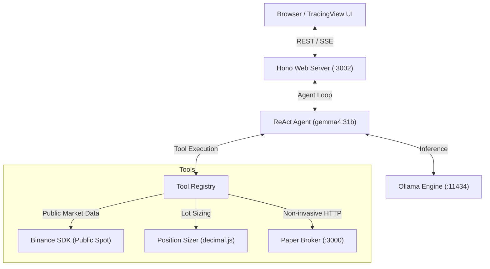

# 🤖 Crypto Agent (Gemma 4 31B) 📈


Autonomous ReAct crypto trading agent powered by `gemma4:31b` via `@nemesis-oss/ollama-sdk`, real-time public Binance market data via `@nemesis-oss/binance-sdk`, precision sizing via `decimal.js`, and seamless HTTP integration with `paper-broker`.

---

## 🏗️ Architecture



---

## 🧠 Architecture v2 — Deterministic Trading Kernel

Branch `feat/coindcx-execution` adds a deterministic trading kernel. The LLM is now one
component inside the system, and it can only **propose** — a hard-gated pipeline decides:

```
Binance (market data ONLY)          CoinDCX (execution ONLY)
        │                                   ▲
        ▼                                   │
  MarketState engine ──► Setup engine ──► Policy Gate ──► Execution FSM
        │                     │          (validator +       │
  MTF / regime /          Analyst role      sizer + risk)   ▼
  liquidity / vol         Strategist role        ──── REJECTED (terminal)
        │                 Risk challenger                 │
        └────────────── EventStore (decisionId audit) ◄──┘
```

- **Trading kernel** (`src/domain`, `src/engines`): order FSM incl. `UNKNOWN` +
  reconciliation, `TradeValidator` (SL<entry<TP geometry, min R:R), professional position
  sizing (fees → slippage → funding → lot step → min notional → caps → margin), `RiskEngine`
  with circuit breaker (`NORMAL → CAUTION → REDUCED → HALTED → EMERGENCY`), prop-firm
  defaults: 0.25% risk/trade, 1% daily stop, 2x max leverage, min RR 2.5.
- **Broker split** (see `docs/ADR-001-broker-split.md`): Binance serves data via a
  provider that *structurally cannot* place orders; CoinDCX executes futures orders
  (idempotent `client_order_id`, TPSL, leverage, INR/USDT auto-fallback with live USDTINR FX).
- **Multi-role agent layer** (`src/agents`): Analyst → Strategist (chooses among
  pre-validated setups) → Risk Challenger (advisory) — all Zod-validated, fail-closed.
- **Multi-timeframe intelligence**: swings/BOS/CHoCH, liquidity sweeps, volatility
  percentile regimes, 9-state regime classification, weighted 4h→5m alignment.

### Kernel tools exposed to the LLM

`get_market_state` · `get_trade_setups` · `propose_trade` (Policy Gate) ·
`execute_approved_intent` · `get_portfolio_state` · `get_risk_status` — plus
`paper_broker_place_order`, now risk-gated (SL/TP required; size is computed by the kernel,
never by the model).

### Running the autonomous kernel loop

```bash
cp .env.example .env           # EXECUTION_VENUE=paper by default
npm install
npm run kernel                 # KERNEL_SYMBOLS=BTCUSDT,SOLUSDT, scans every 5 min
```

Kernel API (observability): `GET /api/kernel/state/:symbol`, `GET /api/kernel/portfolio`,
`GET /api/kernel/events`, `GET /api/kernel/orders`, `POST /api/kernel/pipeline/:symbol`.

Docs: `docs/REVIEW.md` (e2e scorecard) · `docs/ROADMAP.md` (phases + acceptance criteria) ·
`docs/ADR-001-broker-split.md` (venue decision record).

---

## ✨ Features

- **ReAct Decision Loop:** Native tool calling with `think: 'high'` reasoning traces powered by Gemma 4.
- **Rate-Limit Guardian:** Rolling 60s window tracking (`BinanceRateLimiter`, 1200 weight cap, 1000 safe threshold) protecting against Binance 429/418 IP bans.
- **MCP Server Bridge:** Stdio-based Model Context Protocol server (`src/mcp-server.ts`) exposing Binance tools to Claude Desktop and Cursor.
- **Precision Lot Sizing:** Quantitative risk management (`ROUND_DOWN`, zero-division guards) with `decimal.js`.
- **Public Market Tools:** Zero-API-key market intelligence (`ticker24hr`, `depth`, `klines`, `trades`, `avgPrice`) adapted from `@nemesis-oss/binance-sdk`.
- **Non-Invasive Paper Trading:** Safe HTTP bridge to `paper-broker` (`POST /orders`, `GET /positions`) with automatic mock fallback when offline.
- **Streaming SSE & Dashboard:** Real-time token and thought streaming over Server-Sent Events, complete with an embedded dark-mode TradingView Lightweight Charts dashboard.
- **Dockerized GPU Pipeline:** Multi-stage Alpine container, automatic model catalogue verification and pull, NVIDIA GPU passthrough, and persistent model caching.

---

## 🚀 Quickstart

### 1. Docker Compose (Recommended)

Start the entire stack (Ollama + Crypto Agent) with a single command:

```bash
docker compose up --build -d
```

Access the TradingView dashboard and agent chat at `http://localhost:3002`.

### 2. Local Development

Ensure Ollama is running locally on port `11434`:

```bash
# Install dependencies
npm install

# Run test suite (10/10 tests)
npm test

# Run linter and typecheck
npm run lint
npm run typecheck

# Start development server
npm run dev
```

---

## 📡 API Endpoints

| Endpoint | Method | Description |
|---|---|---|
| `/` | `GET` | Embedded TradingView candlestick chart & streaming chat UI |
| `/api/chat` | `POST` | Execute ReAct agent turn (`{ "prompt": "..." }`) |
| `/api/chat/stream` | `GET` | SSE stream for real-time agent thoughts and response tokens (`?prompt=...`) |
| `/api/klines` | `GET` | Lightweight-charts formatted candlestick data (`?symbol=BTCUSDT`) |
| `/metrics` | `GET` | Uptime and heap memory statistics |
| `/health` | `GET` | Service health status |

---

## 🛡️ Paper Broker Safety

This agent operates with strict safety boundaries:
1. **Public Market Data Only:** No live Binance private API keys required.
2. **Zero Paper-Broker Mutations:** The flagship `paper-broker` repository remains 100% untouched. All interactions happen over standard HTTP REST endpoints with graceful offline mocks.