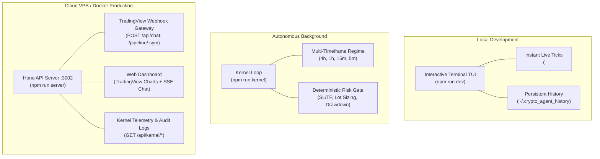

# 🌐 Server & Cloud Deployment Guide

This guide documents the architecture, endpoints, cloud deployment steps, and webhook integrations for the Crypto Agent API Server and Deterministic Trading Kernel.

---

## 1. System Architecture & Operational Modes

The Crypto Agent operates in three primary modes depending on your environment:



| Mode | Command | Target Audience / Use Case |
|---|---|---|
| **Terminal TUI** | `npm run dev` | Real-time interactive session with arrow-key history and sticky tick tape. |
| **Kernel Daemon** | `npm run kernel` | Autonomous background bot that scans every 5 min with risk gate checks. |
| **API Server** | `npm run server` | Cloud VPS deployments, TradingView webhooks, and browser dashboard. |

---

## 2. API Endpoints Specification

Base URL: `http://<host>:3002`

### Agent & Chat Interfaces
- **`POST /api/chat`**
  - **Body:** `{ "prompt": "Analyze SOLUSDT breakout setup" }`
  - **Response:** `{ "answer": "...", "timestamp": 1788764000000 }`
  - **Use Case:** Headless program-to-program prompts or webhook triggers.
- **`GET /api/chat/stream?prompt=<PROMPT>`**
  - **Protocol:** Server-Sent Events (SSE).
  - **Events:** `thinking` (CoT stream), `tool_call`, `tool_result`, `token`, `done`.
  - **Use Case:** Real-time streaming in custom frontend web applications.
- **`GET /api/klines?symbol=BTCUSDT`**
  - **Response:** `{ "symbol": "BTCUSDT", "candles": [{ "time": 1788552000, "open": 79807.44, ... }] }`
  - **Use Case:** Formatted UNIX timestamp OHLCV candlestick data for Lightweight Charts.

### Deterministic Kernel & Telemetry
- **`POST /api/kernel/pipeline/:symbol`**
  - **Use Case:** Trigger an immediate multi-timeframe analysis and risk-checked execution cycle.
- **`GET /api/kernel/state/:symbol`**
  - **Response:** Multi-timeframe market state, 9-state regime classification, swings, BOS, and sweeps.
- **`GET /api/kernel/portfolio`**
  - **Response:** Live equity, available margin, positions, leverage, and circuit breaker status (`NORMAL`, `CAUTION`, `REDUCED`, `HALTED`).
- **`GET /api/kernel/orders`**
  - **Response:** List of open tracked orders managed by the execution engine.
- **`GET /api/kernel/events?limit=50`**
  - **Response:** Event store audit log of all decisions, proposals, and risk rejections.

### Ops & Monitoring
- **`GET /health`** -> `{ "status": "ok", "timestamp": ... }` (Docker/K8s liveness probe)
- **`GET /metrics`** -> Process uptime in seconds and heap memory usage in MB.

---

## 3. Web Dashboard Interface (`/`)

Visiting `http://<host>:3002/` opens the embedded browser dashboard:
- **Left Canvas:** TradingView Lightweight Charts rendering 1h candlestick data auto-fitted to your screen.
- **Right Panel:** Chat interface with streaming thought previews and collapsible tool execution pills.
- **Anti-Cache Guarantee:** Automatically serves `Cache-Control: no-store` headers.

---

## 4. Deploying to a Cloud VPS

### Option A: Docker Compose (Recommended)

1. **Clone repository onto your VPS:**
   ```bash
   git clone https://github.com/shubhamtaywade82/crypto-agent.git
   cd crypto-agent
   ```

2. **Configure `.env`:**
   ```bash
   cp .env.example .env
   ```
   Ensure `PORT=3002`, `EXECUTION_VENUE=paper`, and `BINANCE_TESTNET=false`.

3. **Launch:**
   ```bash
   docker compose up --build -d
   ```
   Docker automatically spins up the Ollama LLM container, pulls `gemma4:cloud`, compiles the TypeScript bundle, and starts the server with auto-restart on reboots.

### Option B: Node.js with PM2 (Without Docker)

```bash
npm install
npm run build
npm install -g pm2
pm2 start npm --name "crypto-agent" -- run server:start
pm2 save
pm2 startup
```

---

## 5. TradingView Webhook Automation

To automatically trigger trade analysis and execution from a TradingView alert:

1. Create an alert in TradingView (e.g. on `SOLUSDT` 15m or 1h chart).
2. Enable **Webhook URL** and set:
   ```text
   http://<YOUR_VPS_IP>:3002/api/chat
   ```
3. In the message body, paste a structured JSON command:
   ```json
   {
     "prompt": "TradingView Alert: {{ticker}} triggered breakout above {{close}}. Run macro BTC filter, formulate risk-gated setup with calculate_position_size, and execute paper trade if approved."
   }
   ```
4. The agent processes the webhook, validates market structure, and registers price watches or orders.

---

## 6. Production Security & Reverse Proxy

### Firewall Setup (UFW)
```bash
sudo ufw allow 22/tcp    # SSH
sudo ufw allow 3002/tcp  # Crypto Agent API
sudo ufw enable
```

### Nginx with SSL (Let's Encrypt)
When placing the server behind an HTTPS domain (e.g. `agent.example.com`), ensure SSE buffering is disabled:

```nginx
server {
    server_name agent.example.com;

    location / {
        proxy_pass http://127.0.0.1:3002;
        proxy_http_version 1.1;
        proxy_set_header Upgrade $http_upgrade;
        proxy_set_header Connection 'upgrade';
        proxy_set_header Host $host;
        proxy_cache_bypass $http_upgrade;
        
        # Critical for SSE stream stability:
        proxy_buffering off;
        proxy_read_timeout 86400s;
    }
}
```
